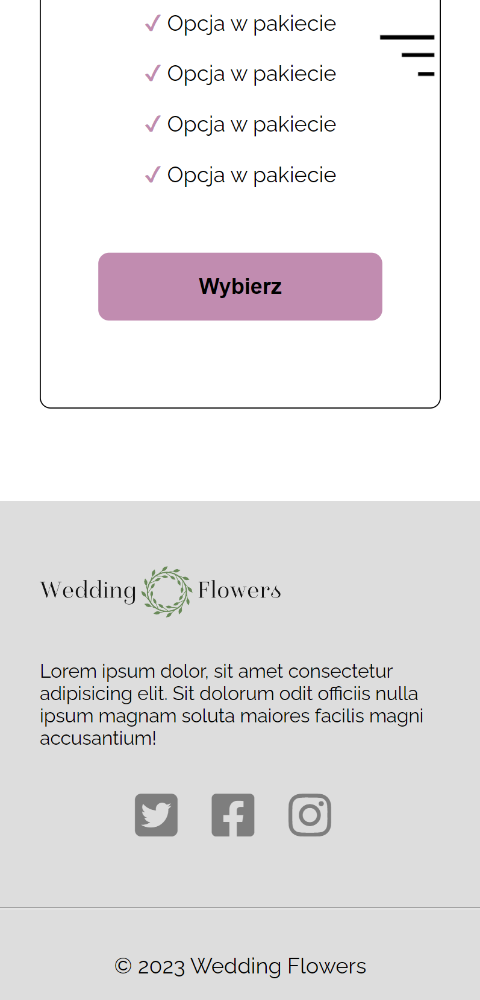

# Wedding Flowers

## Try me
#### [https://wedding-flowers.netlify.app](https://wedding-flowers.netlify.app)

## About
The website presents a floral studio that organizes offers for special events and simple orders. This landing page is a form of business advertising. The page is designed with accessibility in mind. It has both mobile and computer access.

## Features
- Mobile accessbility
- Responsive web design
- Landing Page
- Cart modal
- Offer cards
- Contact form

## Tech
- HTML 
- Vanilla Java Script
- Gulp
- Kit
- Sass

## How to run
Wedding Flowers requires Gulp to run; 
1. Clone repository
2. Use command ``gulp`` to run it locally

## Screens

### Mobile

### Desktop

## License
MIT
